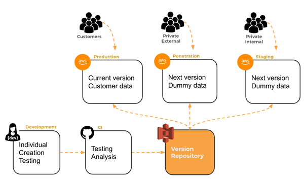

# Making Service Requests with HTTP or CURL
The browser inplicitly asks for `index.html`. Then it gets the file from the server. The server returns those static files. What if the JS running in the front end could make their own requests? So they introduced the XML API. It can go and return the weather or just about anything you want. If we want to request something else, we communicate with HTTP requests.

We make service requests with `curl` looks like:
```
curl -v -s http://info.cern.ch/hypertext/WWW/Helping.html
```

We can change our server to call up service endpoints. These are just functions/methods. Sometimes they are called API's. My service can also call other services like a database or other API. When we hard reload a page, it makes a bunch of service requests (HTML requests for different resources).`xhr` are service requests.

How do we get a resource: `https://byu.edu:443/api/city?q=pro#3`
- `https://` is the scheme or what language we are speaking in
- `byu.edu` is the domain name or who we want to talk to
- `:443` is the port or what software we want to talk to, kind of like the address.
- `/api/city` is the path
- `?q=pro` is the parameter (separated with `&`)
- `#3` is the anchor (one of the sections (often an id on an html tag))

Our server has two programs that are running. One is simon, the other is startup. Both are running on different ports.

It would be confusing if you sayd go to port 3000 on my server. So instead by default go to port 443 (port 80 is the insecure one) with a specific domain name (like `simon.` or `startup.`). So we have Caddy listening on 443. Caddy has a table for the `simon.` or `startup.`. It will then forward it to one program or the other and then return it at the end. Caddy is called a proxy. The programs it runs are differentiated by the subdomain name.

There is another program called SSHD which is how we run the deployment scripts. It is on port 22.

When we go to a website while our port is running, it will connect over port 443, but then slide us over to another port.

## HTTP Requests
Server doesn't make requests to the client. The client makes requests to the server. Here is an example request.
```
POST /user HTTP/1.1
Host: cs260.click
User-Agent: curl/7.77.0
Content-Length: 14
Accept: application/json, text/plain, */*
accept-encoding: gzip, deflate

{"name":"tim"}
```

The basic syntax looks like this:
```
<verb> <url path, parameters, anchor> <version>
[<header key: value>]*
[

  <body>
]
```

- `POST` is the method
- `/user` is the path
- `HTTP/1.1` is the version
- `{"name":"tim"}` is the body
- everything else is the headers

HTTP Methods:
- `GET` get a resource
- `POST` create
- `PUT` update
- `DELETE` delete a resources
- `OPTIONS` create metadata about a resource

Headers:
- Authorization
- Accept
- Content-Type
... a lot more

Body: the body format is defined by the `Content-Type` header. A client specifies what it takes with the `accept` header.

Response
```
HTTP/1.1 200 OK
Content-Type: application/json
Content-Length: 15
Content-Encoding: gzip

{"id":"12", "name":"tim"}
```
- `200 OK` is the status

Status codes
- `1xx` information
- `2xx` are the successful one
- `3xx` succeded but not getting what you asked for
- `4xx` bad request
- `5xx` server error

Content types: Mine types
- `text/html`
- `application/json`
- `image/jpg`
- `video/mp4`

> note that in things like `express`, `res.send(<thing>)` will return the thing as part of the output

### CURL
Making a request
`curl -v https://quote.cs260.click`
- `-v` is verbose
- `-X` lets you specify a http type like POST, PUT....
- `-H` lets you set the header
- `-d` is the data (remeber it depends on what kind of data you want to use)
- `-c` lets you specify a file to store cookies in
- `-b` is used to specifiy a file that has cookies in it that will be sent to service.

From the browser, we can only do `GET` requests.

`curl -X POST https://quote.cs260.click -d '{"author":"lee", "quote":"code fast"}'` is a valid request, but the endpoint doesn't actually allow you to do this.

Fetch is the `js` that will make a request `fetch(url).then(r => r.json()).then(j => console.log(j.value))`. First makes the request, converts to json and then prints it.

`fetch(quote.cs260.click).then((r) => r.json()).then(t => console.log(t))` 

## Cookies
Cookies are used to track data because HTTP requests don't have access to anything like that. They are generated by a server adn passed to the client as an HTTP header. It is basically an authentication token that you give to the user as long as they are logged in.

```
HTTP/2 200
Set-Cookie: myAppCookie=tasty; SameSite=Strict; Secure; HttpOnly
```

Every time the client makes a request, it returns the cookie to the server.

## URL
```
https://byu.edu:443/cs/260/student?filter=accepted#summary
<scheme>://<domain name>:<port>/<path>?<parameters>#<anchor>
```
This is the general format.
- `scheme` is the protocol
- `domain name` is the domain
- `port` is the port used to connect to the domain's server. HTTP defaults to 80, HTTPS defaults to 443
- `path` the path to the resource. This is not necessarily an actual path, but can be a logical representation of a path
- `parameters` are the parameters or filters, sometimes called query string
- `anchor` a sub-location in the resource, called hash, or fragement id (this is where auto-scrolling happens)

> A URN (uniform resource name) does not specify location information
> A URI (uniform resource identifer) can refer to a URL or URN.

# Ports
Ports allow us to use different connection protocols (like HTTP, HTTPS, or SSH).

You can have as many servers as you want, but each need a different port.


# Web Servers
A web server hosts a web service and also knows how to accept connections and speak with HTTP. It is separate from the service. In today's world, we have made it so you can have a web server that contains your service.

Express is a web server that can host your service.
```
const express = require('express');
const app = express();

// Serve static files from the 'public' directory
app.use(express.static('public'));

app.listen(80);
```
This program initalizes `express` and makes it so that you can serve static files.

## Endpoints
Endpoints are methods that we can call from the web. This makes it ineractive (rather than just giving a static HTML file). Add an endpoint like this
```
app.get('/time', (req, res) => {
  res.json({ time: new Date().toDateString() });
});
```
Note that `get` is the HTTP action, and `/time` is the path.

## Gateways
Gateways are web services that can serve up other services on different ports. We connect with a web server to our gateway and then it will connect us to the other services we have. So people connect to the gateway on port 443 and behind the scenes it redirects them to other ports.


## Microservices
A single small web services that you can duplicate to handle more users

## Serverless
This came after microservices. This basically takes the server out of the whole process. Everything else is handled by the gateway.

# Web services
The frontend is the `index.html` and everything else that that references.

If we want our frontend to make a request to another service, we use `fetch(<url>)`. We want other people to be able to do the same for our service. Right now with React, JS, html, and css we have all the frontend, but we want to be able to make a web service that allows other people to call it. So we need to make the backend.

An `endpoint` or `API` is just a function that you call that belongs in another program. We access them with the `fetch` function.


So basically, our service contains our static files (frontend containing html, js, css, react...), our endpoints that the frontend calls to change things, and other requests (API's) that call other services. Our frontend can also call other services as well.

# `Fetch`
`fetch` is built into the browser's js runtime. It takes a URL and returns a promise. You pass it a url, and then call `then` on the result. In then, we pass a fucntion that is called after the data is retrieved.
```
fetch('https://quote.cs260.click')
  .then((response) => response.json())
  .then((jsonResponse) => {
    console.log(jsonResponse);
  });
```
Returns
```
{
  author: 'Kyle Simpson',
  quote: "There's nothing more permanent than a temporary hack."
}
```

You can also `POST` things by passing in an HTTP request
```
fetch('https://jsonplaceholder.typicode.com/posts', {
  method: 'POST',
  body: JSON.stringify({
    title: 'test title',
    body: 'test body',
    userId: 1,
  }),
  headers: {
    'Content-type': 'application/json; charset=UTF-8',
  },
})
  .then((response) => response.json())
  .then((jsonResponse) => {
    console.log(jsonResponse);
  });
```

# Now we are writing a backend service thing
We make a fetch request - by default is `index.html`. We write a super small program that listens and returns something. Everything up to the port gets to the right program. The program takes in the path and returns something (like a json file). We can return html, or static files.

# Service Design
How can we use good software design? The endpoints we are using will be called by other people.

Try to make endpoints human readable and discoverable. Try to make it so that your endpoints are backwards compatable. Make sure things are documented as well.

There are a few ways to organize endpoints in cluding REST, GraphQL, and RPC.

There is a lot more information about this that you can check out.

# Node Web Service
Create a node project.

```
const http = require('http');
const server = http.createServer(function (req, res) {
  res.writeHead(200, { 'Content-Type': 'text/html' });
  res.write(`<h1>Hello Node.js! [${req.method}] ${req.url}</h1>`);
  res.end();
});

server.listen(8080, () => {
  console.log(`Web service listening on port 8080`);
});
```
This creates an HTTP server. Every time it receives a HTTP request, it calls the function. You can run this in the console by running `node index.js`, or you can run it in vscode which will enable the debugger.

# Express
We use npm to pull down express which makes this easier.

> "People tell you to not reinvent things, but I think you should ... it will teach you things" - TJ Holowaychuk

Express is just some js code that makes some wrappers over network requests. It executes things in order every time you get a new HTTP request!!!

Key objects:
- `express` constructor and default functionality. Top level object, when we call it it will create the app
- `app` is the service application, sets the port.
- `req` and `res` app gives you request and response. HTTP request and response.
```
const express = require('express');
const app = express();
app.listen(8080);
```

`express.static('public');` will look in the public folder for static files

```
const express = require('express');         // note that all objects are also functions in JS, this imports the code
const app = express();                      // that exports one object called express

// specify endpoint
// whenever we have a get request, we take anything (*, could also be a specific path)
app.get('*', (req, res) => {                // any get method will send Hello Express! right back
    res.send('<h1>Hello Express!</h1>');
});

app.listen(3000, () => {                    // what port we want to listen on with a function to call when it works
    console.log('Server is running on http://localhost:3000');
});
```

Run the program from vs code and open in your browser, then use a curl request `curl -v localhost:3000`. Express looks at what you return and determines if it is a string.

We could also do something like `res.send(404, '<h1>Not found</h1>');`. 

It is kinda weird that takes html files and stick it right in your code. So we can return a static file instead. `app.use(express.static('pubic'));`. `app.use` doesn't care if it is a get request or anything else. It will return whatever they asked for. So we can create files like `index.html`, `john.html`. Then when we request `localhost:3000/john.html` it will give you that. We can even serve up images or things like that by replacing the file with `image.png` or something like that.

You can include parameters from a url.
```
app.get('/store/:storeName', (req, res, next) => {
  res.send({ name: req.params.storeName });
});
```

# Responses
```
res.send('<p>html</p>');    // HTML
res.send('text');           // HTML
res.send({ x: '3', y: 4 }); // JSON
res.json({ x: '3', y: 4 }); // JSON
```

The order of your handlers is important. If you have a valid index.html that you register before a * handler, it will go get the index.html.

Put these in Get handlers
```
res.redirect(301, 'https://cs260.click')    // redirect if the page has moved

res.sendFile('index.html', {root: 'public' });  // basically the same thing as static files, but only for one

// these are the same
res.status(400).send('trouble in River City');  // status code.
res.send(400, 'trouble in River City');
```

# Middleware
This is a standard design method (like iterators). The Mediator (like Express) doesn't really know how to do things, but it calls other stuff to do different things (the middleware). The idea is we get some sort of request, then it goes to request, next and then request, then response and pass out the HTTP response.

We don't want Bob to steal our money. In our case it is more like an authToken or something like that.
```
function noBobs(req, res, next) {       // if a certain case (/bob path), it will return something and if not, it will default to next function.
    /bob/.text(req.path) ? res.status(401).send('No Bobs!') : next();
}

app.get('/secrets', noBobs, (req, res) => {     // if noBobs succeeds, it will call the next function (req, res)
    res.send('<p>Hello</p>');                   // note that the next function is in the noBobs.
});
```
This is useful for authentication. Make it a secure enpoint basically.


We could even change the request
```
function noBobs(req, res, next) {       // if a certain case (/bob path), it will return something and if not, it will default to next function.
    res.isBob = /bob/.test(req.path);
    next();
}

app.get('/secrets/*', noBobs, (req, res) => {    // if noBobs succeeds, it will call the next function (req, res)
    res.send(\`<p> hello bob? ${req.isBob ? "yes" : "no"}\`);
});
```

Parameters
```
// 
app.get('/store/:id/:time', (req, res) => {
    res.send({ id: req.params.id, time: req.params.time });
});

app.put('/*/:id', (req, res) => {
    res.send({ update: req.params.id });
});

app.dlete(/\/store\/(.*)/, (req, res) => {
    res.send({ delete: req.params[0] });
});
```

Parsing json files
```
app.use(express.json());    // parsing json requests

app.put('/data', (req, res) => {
    res.send(req.body.msg);
});
```

> note that `res.send({body})` will send back the result with the specified body.

## Built in middlware
```
app.use(express.static('public'));
```
Will respond with static files that match the URL

`npm install cookie-parser`
```
const cookieParser = require('cookie-parser');

app.use(cookieParser());

app.post('/cookie/:name/:value', (req, res, next) => {
  res.cookie(req.params.name, req.params.value);
  res.send({ cookie: `${req.params.name}:${req.params.value}` });
});

app.get('/cookie', (req, res, next) => {
  res.send({ cookie: req.cookies });
});
```
This is an example of a third party middleware function. We often see middleware adding fields to `req` and `res`.

## You rown middleware
```
app.use((req, res, next) => {
  console.log(req.originalUrl);
  next();
});
```
This is a logging function.
## Error handling middleware
```
app.get('/error', (req, res, next) => {
  throw new Error('Trouble in river city');
});

app.use(function (err, req, res, next) {
  res.status(500).send({ type: err.name, message: err.message });
});
```
This throws an error and then immediately catches it and returns the result.

# Modules
## Node modules (CommonJS modules)
Need to export and import them. `const express = require('express');`

If you want to export your own
```
function alertDisplay(msg) {
    alert(msg);
}

module.exports = {
    alertDisplay,
};
```

## JS modules (ES modules) with Node
If you want to use JS modules with Node, you need to specify that in `package.json`
```
{
  "name": "service",
  "version": "1.0.0",
  "description": "This demonstrates a service for a web application.",
  "type": "module",
  "dependencies": {             // this is the place
    "express": "^4.18.2"
  }
}
```

To use them, do
```
import express from 'express`;
express().listen(3000);
```

To export from your own code:
```
export function alertDisplay(msg) {
  console.log(msg);
}
```
Then import it in another file
```
import { alertDisplay } from './alert.js';

alertDisplay('called from main.js');
```

## JS modules (ES modules) in a browser
Modules can only be called from other modules. 
```
<script type="module">
  import { alertDisplay } from './alert.js';
  alertDisplay('module loaded');
</script>
```

If we wnat to use a module in a global scope:
```
<html>
  <body>
    <script type="module">
      import { alertDisplay } from './alert.js';
      window.btnClick = alertDisplay;

      document.body.addEventListener('keypress', function (event) {
        alertDisplay('Key pressed');
      });
    </script>
    <button onclick="btnClick('button clicked')">Press me</button>
  </body>
</html>
```

## Service Daemons
Programs shut down when the computer goes down. WE want it to run in the background sometimes though. This is where service daemons come in.

Say you want to set up another subdomain:
### Modify caddy file
SSH into your server
```
tacos.cs260.click {
  reverse_proxy _ localhost:5000
  header Cache-Control none
  header -server
  header Access-Control-Allow-Origin *
}
```
- disable caching
- don't say I am using caddy
- allow other origin servers to make requests

Then restart caddy `sudo service caddy restart`

### Create the web service
`cp -r ~/services/startup ~/services/tacos`

Set up a port from a command line arguments 
```
const port = process.argv.length > 2 ? process.argv[2] : 3000;
app.listen(port, () => {
  console.log(`Listening on port ${port}`);
});
```

enable a static file
```
app.use(express.static('public'));
```

Then start it up with `node index.js 5000`. Or even `curl https://tacos.cs260.click`

Caddy will receive this request and map it from `tacos` to `localhost`

### Configure PM2 to host the web service
The problem is that as soon as you ssh out, it will all shut down. That is why we have `PM2`.

While `ssh`ed in, run `pm2 ls`

Run this and it will keep things running even when you are gone!
```
cd ~/services/tacos
pm2 start index.js -n tacos -- 5000
pm2 save
```

# Security
SOP or Same Origin Policy is that JS can only make requests to a domain if it is in the same domain the user is viewing. This doesn't work great if you want to use a public resource.

CORS or Cross Origin Resource Sharing is where the client talks to the server and gives it the origin of a request. Based on that the server responds with what is allowed. 

The browser is in charge of doing this.

Make sure to test services before using them. When you make a request, the response will include if you are allowed to access it with the header `access-control-allow-origin`.

# Authentication vs Authorization
- Authentication: username and pasword
- Authorizatoin: Access to different thigns

Pass an auth token back to our service, the backend looks at it and checks to make sure everything is good. Then it saves teh score.

Standard protocols for Authentication:
- OAuth
- SAML (really old)
- CAS (The one BYU uses)
- OIDC (adds Authorization onto OAuth)

Single sign on: use same credentials for multiple web apps. Federated login: login once and authToken used for multiple websites, like logging into gmail, youtube, google docs.
- AuthO
- Google
- Facebook
- Duo
- AWS

It is really easy to mess up authentication.

We create our own Custom authentication. We need to 
- store user credentials
- verify credentials
- restrict access

## Account creation and login
Need three endpoints (four is helpful)
- register (POST)
- login (POST)
- logout (DLETE)
- get me (GET)

### Requests
An example of register would look like:
```
POST /api/auth HTTP/2
Content-Type: application/json
{
  "email":"marta@id.com",
  "password":"toomanysecrets"
}

HTTP/2 200 OK
Content-Type: application/json
Set-Cookie: auth=tokenHere
{
  "email":"marta@id.com"
}
```

### Service
The code for this would look something like this
```
const express = require('express');
const app = express();

//register
app.post('/api/auth', async (req, res) => {
  res.send({email: 'marta@id.com'});
});

// login
app.put('/api/auth', async (req, res) => {
  res.send({ email: 'marta@id.com' });
});

// logout
app.delete('/api/auth', async (req, res) => {
  res.send({});
});

// getMe
app.get('/api/user', async (req, res) => {
  res.send({ email: 'marta@id.com' });
});

app.listen(3000);
```

### Handle requests
We know everything we receive will be a json object. So we want to parse everything that way.
```
app.use(express.json());

app.post('/api/auth'< (req, res) => {
  res.send(req.body);
});
```
This will parse everything as json.

#### Users and passwords
How do we store credentials successfully? We don't want to just store a raw text password. If they get in you db, they have access to all your passwords. So we cryptographically hash it. We cannot get to it again, but what we can do is we can get a password and hash it and then look if they match.
- `Salt` puts random generated text onto your password and then it 
- `Pepper` is a random value you put on all of the passwords, but you don't share it.

We will use `Bcrypt`. In `webServices/login/exampleCode/bcrypt`. Step through this for help.


Use this code:
```
const bcrypt = require('bcryptjs');

const users = [];

async function createUser(email, password) {
  const passwordHash = await bcrypt.hash(password, 10);

  const user = {
    email: email,
    password: passwordHash,
  };

  users.push(user);

  return user;
}

function getUser(field, value) {
  if (value) {
    return users.find((user) => user[field] === value);
  }
  return null;
}
```

### Register
If we have the user already, return a 409 error. If we don't, it will create a user and then return the users email. We need to generate an auth token and store it on the browser with a cookie.
```
app.post('/api/auth', async (req, res) => {
  if (await getUser('email', req.body.email)) {
    res.status(409).send({ msg: 'Existing user' });
  } else {
    const user = await createUser(req.body.email, req.body.password);
    res.send({ email: user.email });
  }
});
```

#### Authorization tokens
`npm install uuid` This is an authtoken. We don't want the authToken to be tied to the password. It uses an algorithm, it is extremely unlikely that it will return the same thing twice.
```
const uuid = require('uuid');
const token = uuid.v4()
...
```

#### How do we pass the UUID (Auth tokens) around? Cookies
The service generates an authToken. It stores it and sends it back in a cookie  The frontentd only cares that you have thie token. Cookies are a way where the frontend recovnizes if you have been there before. The server will ask for it every time until it takes it away. The frontend can't read the cookie, it just recovnizes that it has been there

When we set the cookie, we include a few options.
```
Set-Cookie: token=<uuid>; Secure; HttpOnly; SameSite=Strict

```
- `Secure` will only do HTTPS and not HTTP
- `HttpOnly` will say that JS can't read the cookie
- `SameSite=Strict` only give the cookie to the backend that generated the cookie.

So things will look somethin glike this
```
const cookieParser = require('cookie-parser');
app.use(cookieParser());

// Create a token for the user and send a cookie containing the token
function setAuthCookie(res, user) {
  user.token = uuid.v4();

  res.cookie('token', user.token, {
    secure: true,
    httpOnly: true,
    sameSite: 'strict',
  });
}
```

#### How to store the auth token in the cookie
Should look like something like this
```
const cookieParser = require('cookie-parser');
const uuid = require('uuid');

app.use(cookieParser());

function setAuthCookie(res, user) {
  user.token = uuid.v4();

  res.cookie('token', user.token, {
    secure: true,
    httpOnly: true,
    sameSite: 'strict',
  });
}

// Registration endpoint
app.post('/api/auth', async (req, res) => {
  if (await getUser('email', req.body.email)) {
    res.status(409).send({ msg: 'Existing user' });
  } else {
    const user = await createUser(req.body.email, req.body.password);

    setAuthCookie(res, user);

    res.send({ email: user.email });
  }
});
```

### login
```
app.put('/api/auth', async (req, res) => {
  const user = await getUser('email', req.body.email);
  if (user && (await bcrypt.compare(req.body.password, user.password))) {
    setAuthCookie(res, user);

    res.send({ email: user.email });
  } else {
    res.status(401).send({ msg: 'Unauthorized' });
  }
});
```
`bcrypt.compare` taqkes in the text password and does its hash thing and compares it to the stored user password.

If the user exists and the passwords match, then we make a cookie and return the email, if not we return a 401 code.

### logout
```
app.delete('/api/auth', async (req, res) => {
  const token = req.cookies['token'];
  const user = await getUser('token', token);
  if (user) {
    clearAuthCookie(res, user);
  }

  res.send({});
});

function clearAuthCookie(res, user) {
  delete user.token;
  res.clearCookie('token');
}
```
If there is an actual user, we delete the token and cookie. If not, we ignore it.

### getMe
```
app.get('/api/user/me', async (req, res) => {
  const token = req.cookies['token'];
  const user = await getUser('token', token);
  if (user) {
    res.send({ email: user.email });
  } else {
    res.status(401).send({ msg: 'Unauthorized' });
  }
});
```
This will make sure we have a saved token sent back from the client. We check it and return the email if it is valid.

> We use curl as our client `curl localhost:3000/register -H "Content-Type: application/json" -d '{"user":"cow","password":"1"}'` will retister a user.
> We are using the `express.json()` middleware, so we include `application/json` which will parse it as a json.
> We use curl as our client `curl -X PUT localhost:3000/register -H "Content-Type: application/json" -d '{"user":"cow","password":"1"}'` will retister a user.

## Summary
So basically we make a register request and the service will add a new user with new cookie info. It will send back the cookie data to the client and print out the user email.
Then when we login, curl handles the cookie (because we )

## Connecting it all together
Create an npm project with `npm install vite@latest -D`, `npm install react react-dom react-router-dom`. 
`index.jsx`
```
function App() {
  return (
    <BrowserRouter>
      <main>
        <Routes>
          <Route path='/' element={<Login />} exact />
          <Route path='/profile' element={<Profile />} />
        </Routes>
      </main>
    </BrowserRouter>
  );
}
```
Basic browser router login component

`Login`
```
function Login() {
  const navigate = useNavigate();
  const [email, setEmail] = React.useState('');
  const [password, setPassword] = React.useState('');

  function handleLogin() {
    createAuth('PUT');
  }

  function handleRegister() {
    createAuth('POST');
  }

  async function createAuth(method) {
    const res = await fetch('api/auth', {
      method: method,
      headers: { 'Content-Type': 'application/json' },
      body: JSON.stringify({ email, password }),
    });
    await res.json();
    if (res.ok) {
      navigate('/profile');
    } else {
      alert('Authentication failed');
    }
  }

  return (
    <div>
      <h1>Login</h1>
      <div>
        <label>Email:</label>
        <input type='text' onChange={(e) => setEmail(e.target.value)} required />
      </div>
      <div>
        <label>Password:</label>
        <input type='password' onChange={(e) => setPassword(e.target.value)} required />
      </div>
      <button type='submit' disabled={!(email && password)} onClick={handleLogin}>
        Login
      </button>
      <button type='button' disabled={!(email && password)} onClick={handleRegister}>
        Register
      </button>
    </div>
  );
}
```
So we are always updating the email and password. Then when the user clicks one of th ebuttons (handle login or handle register), we call that function and then it creats an authorization with a specific HTML method. It sends the correct data over and may navigate, but may not.

`Profile`
```
function Profile() {
  const navigate = useNavigate();
  const [userInfo, setUserInfo] = React.useState('');

  React.useEffect(() => {
    (async () => {
      const res = await fetch('api/user/me');
      const data = await res.json();
      setUserInfo(data);
    })();
  }, []);

  function handleLogout() {
    fetch('api/auth', {
      method: 'DELETE',
    });
    navigate('/');
  }

  return (
    <div>
      <h1>Profile</h1>
      <div>Logged in as: {userInfo.email}</div>
      <button type='button' onClick={handleLogout}>
        Logout
      </button>
    </div>
  );
}
```
On first render, it fetches the user info and converts it to json, then sets it. It has a logout button that will delete our authorization and return to the main page.

### Running
To run everything, f5 run index.js for the backend, and run the frontend with `npm run dev` in the root. All this is in `profile/webServices/login/exampleCode/login`.


## Going over the code
The frontend code is in the root, the backend is in a subdirectory.

Anything security related should be done in the backend.

What endpoints do we want? 
- `post`, `/api/auth` Creates an authentication token (register)
- `put`, `/api/auth` Update authorization (login)
- `delete`, `/api/auth` logout (delete authentication token)
- `get`, `/api/user/me` get the current user information for the currently authenticated user.

The browser automatically returns the cookie as soon as the backend sets it.

Have to start both the frontend and the backend.

# Deployment
For us we build something, and then push it to github. Then every once in a while we `deploy.sh` it to production. Normally people just start with React.

In industry things are a little different. It starts with the developer. They push to a version repository where it goes through testing and analysis in a continuous integration (CI) program. If it passes there, it goes to a version repository. That contains all the versions. Then that controls pushing it to production. Sometimes we have a staging environment which doesn't have user data. This is only used internally. All the teams look at it internally first and they work on it. A Sales environment has dummy data. You can also have other environments like integration testing, or penetration or load testing.



We use a simple shell script to deploy ours.

Parsing the command line arguments
```
while getopts k:h:s: flag
do
    case "${flag}" in
        k) key=${OPTARG};;
        h) hostname=${OPTARG};;
        s) service=${OPTARG};;
    esac
done

if [[ -z "$key" || -z "$hostname" || -z "$service" ]]; then
    printf "\nMissing required parameter.\n"
    printf "  syntax: deployService.sh -k <pem key file> -h <hostname> -s <service>\n\n"
    exit 1
fi

printf "\n----> Deploying $service to $hostname with $key\n"
```

Creat a distribution directory
```
# Step 1
printf "\n----> Build the distribution package\n"
rm -rf dist
mkdir dist
cp -r application dist
cp *.js dist
cp package* dist
```

Set a target directory
```
# Step 2
printf "\n----> Clearing out previous distribution on the target\n"
ssh -i $key ubuntu@$hostname << ENDSSH
rm -rf services/${service}
mkdir -p services/${service}
ENDSSH
```

Copy `dist` to production
```
# Step 3
printf "\n----> Copy the distribution package to the target\n"
scp -r -i $key dist/* ubuntu@$hostname:services/$service
```

Install packages and restart `PM2`
```
# Step 4
printf "\n----> Deploy the service on the target\n"
ssh -i $key ubuntu@$hostname << ENDSSH
cd services/${service}
npm install
pm2 restart ${service}
ENDSSH
```

Remove local `dist` directory
```
# Step 5
printf "\n----> Removing local copy of the distribution package\n"
rm -rf dist
```

A peculiarity of this class. Everything outside of service is frontend code. Inside service is backend code. Vite looks in src to compile everything together.

Now that we write a service, we are in charge of hosting the static files. We want to use vite's hot loading server that continuously updates. Right now we have two servers one for the frontend and the other for the backend. We want to switch that so we can update them all at the same time. So the backend code starts as a subdirectory of the frontend code and then it flips.

# Shell Script
Not there are two different programs with different dependencies, the frontend and the backend. Both you have to `npm install`

# Uploading files
Have you ever wanted to upload a file to a website?

Frontend: you can only have certian filetypes, also calls `uploadFile`
```
<html lang="en">
  <body>
    <h1>Upload an image</h1>
    <input type="file" id="fileInput" name="file" accept=".png, .jpeg, .jpg" onchange="uploadFile(this)" />
    <div>
      
    </div>
    <script defer src="frontend.js"></script>
  </body>
</html>
```

JS
```
async function uploadFile(fileInput) {
  const file = fileInput.files[0];
  if (file) {
    const formData = new FormData();
    formData.append('file', file);    // appending the data as a file

    const response = await fetch('/upload', {
      method: 'POST',
      body: formData,
    });

    const data = await response.json();
    if (response.ok) {
      document.querySelector('#upload').src = `/${data.file}`;
    } else {
      alert(data.message);
    }
  }
}
```

Multer handles all the backend. It reads files from http requests, enforces size of upload, stores the file in the `public` directory
`npm install express multer`
- `express` handles network communicaiton
- `multer` handles HTTP file transfer

With files, the data is huge and `multer` handles all the details for you

`mkdir fileDemo && cd fileDemo`
`npm init -y`
`npm install express multer`
open vs code
the package.json file has the correct depencencies
create index.js

What if you want to save the files and rename them
```
const express = require('express');
const multer = require('multer');

const app = express();

app.use(express.static('public'));

const upload = multer({
  storage: multer.diskStorage({
    destination: 'public/',
    filename: (req, file, cb) => {
      const filetype = file.originalname.split('.').pop();
      const id = Math.round(Math.random() * 1e9);
      const filename = `${id}.${filetype}`;
      cb(null, filename);
    },
  }),
  limits: { fileSize: 64000 },
});

app.post('/upload', upload.single('file'), (req, res) => {
  if (req.file) {
    res.send({
      message: 'Uploaded succeeded',
      file: req.file.filename,
    });
  } else {
    res.status(400).send({ message: 'Upload failed' });
  }
});

app.use((err, req, res, next) => {
  if (err instanceof multer.MulterError) {
    res.status(413).send({ message: err.message });
  } else {
    res.status(500).send({ message: err.message });
  }
});

app.listen(3000, () => {
  console.log('Server is running on port 3000');
});
// post request. When we have an upload request, it calls the multer middleware, and then calls our function.
// our static middleware is going to 
```

Express gets requests and it walks down the tree to find a mathing function. 

Express will be our HTTP server. We need to create a public directory, create an `index.html` then add a the frontend .js file.

Fetch by default returns a promise....

Launch backend code in vscode and debug the frontend code in the browser. We rented 8gb.

AWS S3 has a big capacity, only pay for what you use. You can call their services to store more things. Often servers switch out for bigger capacity or things like that so any static files will be lost if you switch. There are also often multiple servers. Which one is your user's data on?