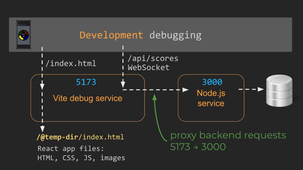

# Databases
## Storage Services
Here are some example database services:
```
Amazon S3
Google Cloud Storage
Microsoft Azure Storage
IBM Cloud Object Storage
MinIO
OpenStack Swift
```

We will use S3. It has unlimited capacity and you only pay for how much storage you use. If you want to use it, here are the steps:
1) Creating a S3 bucket to store your data in.
2) Getting credentials so that your application can access the bucket.
3) Using the credentials in your application.
4) Using the SDK to write, list, read, and delete files from the bucket.

Install
`npm install @aws-sdk/client-s3 @aws-sdk/credential-providers`

Get an aws key and store it in `~/.aws/credentials`. Then create an instance in your code
```
const s3 = new S3Client({
  credentials: fromIni(),
});
```

Example
```import { S3Client, PutObjectCommand, GetObjectCommand } from '@aws-sdk/client-s3';
import { fromIni } from '@aws-sdk/credential-providers';

const s3 = new S3Client({
  credentials: fromIni(),
});

const bucketName = 'your-bucket-name-here';

async function uploadFile(fileName, fileContent) {
  const command = new PutObjectCommand({
    Bucket: bucketName,
    Key: fileName,
    Body: fileContent,
  });
  return s3.send(command);
}

async function readFile(fileName) {
  const command = new GetObjectCommand({
    Bucket: bucketName,
    Key: fileName,
  });
  const { Body } = await s3.send(command);
  return Body.transformToString();
}

await uploadFile('test.txt', 'Hello S3!');
const data = await readFile('test.txt');

console.log(data);
```

## Data Services
Our service makes a request to get the scores. Our service doesn't store those, so we talk to a database even farther back. Our database is not on our server because of storage space.

Relational databases and relational queries. SQL is basically the standard for retrieving data.

The nice thing is that we are using someone else to store our data. So we don't have to install any crazy software.

| Service | Specialty | 
| --- | --- |
| MySQL | Relational queries |
| Redis | Memory cached objects: didn't store on disk, they just stored in memory. Super fast |
| ElasticSearch | Ranked free text: store a whole book, search through it |
| MongoDB | JSON objects: make it easy for programmers |
| DynamoDB | key value pairs: key and a value |
| Neo4J | Graph based data: like a network |
| InfluxDB | Time series data |

## MongoDB
Collections of data, products, users, purchases is called a database. Clusters are copies of databases for redundancy. A collection is an array with a bunch of JSON objects in it. It will automatically specify the id if you don't.

Mongo is pretty fluid (like js) of what you can add to objects. It doesn't have a set schema where you have to specify everything that goes in the database. Cluster -> Database -> collections (useres, scores, classes taken)

Create your cluster on MongoDB Atlas. Make sure to include what computers can connect `0.0.0.0/0`
Here is an example of some queries.
```
// find all houses
db.house.find();

// find houses with two or more bedrooms
db.house.find({ beds: { $gte: 2 } });

// find houses that are available with less than three beds
db.house.find({ status: 'available', beds: { $lt: 3 } });

// find houses with either less than three beds or less than $1000 a night
db.house.find({ $or: [(beds: { $lt: 3 }), (price: { $lt: 1000 })] });

// find houses with the text 'modern' or 'beach' in the summary
db.house.find({ summary: /(modern|beach)/i });
```

Copy the connection string so you can use it in your code.

```
git init
npm init -y
npm install mongodb
```

Create a `dbConfig.json` file that looks like this
```
{
  "hostname": "cs260.abcdefg.mongodb.net",
  "userName": "myMongoUserName",
  "password": "toomanysecrets"
}
```
> DO NOT CHECK THIS INTO GITHUB
We can use this to log in to the database. The values we provide will be put in the URI below.
```
mongodb+srv://mongo:<db_password>@morsecodeclicker.jxrmo.mongodb.net/?retryWrites=true&w=majority&appName=morsecodeclicker
```
- `mongodb+srv` is a custom protocol for efficiency
- `mongo:<db_password>` is the username and password for our database. This is generally bad, but they have their own protocola that is encrypted so it is fine.
- `@morsecodeclicker` is the hostname
- `jxrmo.mongodb.net` is their hostname
- `?` after this is parameters.

```
const { MongoClient } = require('mongodb');   // import source code
const config = require('./dbConfig.json');    // bring in the credentials

const url= `mongodb+srv://${config.userName}:${config.password}@{config.hostname}`;   // the right url to talk to

const client = new MongoClient(url);    // initalize a MongoClient
const db = client.db('rental');         // using a database called rental (automatically created)
const collection = db.collection('house');    // using a collection called house (automatically created)
```

### Test the connection
```
try {
  await db.command({ping: 1});
  console.log(`DB connected to ${config.hostname}`);
} catch (ex) {
  console.log(`Error with ${url} because ${ex.message}`);
  process.exit(1);
}
```
> Note that in order to do this, we need to put our `await` in an `async` function.

```
async function main() {
  try {
    await db.command({ping: 1});
    console.log(`DB connected to ${config.hostname}`);
  } catch (ex) {
    console.log(`Error with ${url} because ${ex.message}`);
    process.exit(1);
  }
}

main().then(() => {
  console.log("DONE!");
  }
);
```

Inserting `await collection.insertOne(house);`

> You need to close the network connection at the end with `await client.close();`. Do this with at `try finally` block.

### Insert Data
```
await collection.insertOne(house);
```
If you don't give the object and id, mongo will assign one for you.

### Querying data
`collection.find();` return everything
`collection.find({beds: { $gte: 2}});` any object that has a `beds` field that is greater than or equal to 2
`colleciton.find({status: 'open', beds: {$ls: 3} });`
`collection.find({$or: [{beds: {$lt: 3}}, {price: {$lt: 1000}}]});`

You can also include how you want the data to return

```
const options = {
  sort: {name: -1},
  limit: 10,
};

const cursor = collection.find(query, options);
const rentals = await cursor.toArray();
rentals.forEach((i) => console.log(i));
```
> Note the await

### Deleting data
```
const query = { property_type: 'Condo', beds: {$lt:2}};
await collection.deleteMany(query);
```
`deleteOne()` is also an optoin

### Update functionality


# Simon/Startup DB
Clone it.
Probably won't have any changes in frontend code.
Remember to use `npm install` in the service directory. That will install make a folder `node_modules`
There are two programs a service and a client or a backend and a frontend. The backend runs in virginia. The frontend runs on the browser. Our repo has the frontend and backend code. The frontend code is in the root, the backend is in the service directory.

Line 1: require mongo

Note on the `require` syntax. This is a nodejs thing, but then JS came up with their own thing esmodules (`import`) that are becomming more common. We use commonjs and our backend uses esmodules.
Import: `const { MongoClient } = require('mongodb');`
Export: 
```export function alertDisplay(msg) {
  console.log(msg);
}
```

Line 2: dbConfig.json file
Line 4: accesses `dbConfig.json` and gets our url for the database
Line 5: specify the client
Line 6: create a database
Line 8: create a collection for scores

Line 11: connects to the database to make sure it is working. Note that it is an async function that doesn't work in the top level, so we create it and then call it immediately. So it will go to other code adn asyncrousnly do it. If it fails, it will crash the program.

Line 21: a function to find and get the user by email
Line 25: a function to find and get the user by token
Line 29: a funciton to insert a new user
Line 33: a function to update a user
Line 37: a function to insert a new score
Line 41: a function to get the high scores (we let mongo do all the work)

`index.js`
Line 11: parse command line arguments
Line 14: if it is json, parse it
Line 17: cookie parser
Line 20: load up static files
It pulls out all the memory stuff and puts in database stuff.

To debug our code, we need to run two programs. We got to index.js and do f5, debug with Node.js This is the backend running under express in the service directory. Then we have our frontend code using react. We use `npm run dev` which executes `vite` or even `curl`. But we need to install `vite` with `npm install`. Now we run it again. 

Our frontend will be run by vite on port 5173. But we want it to proxy all the requests to the backend so we need to set up a `vite.config.js` file with these parameters in the root of the project.
```
import { defineConfig } from 'vite';

export default defineConfig({
  server: {
    proxy: {
      '/api': 'http://localhost:3000',
    },
  },
});
```
The whole process will look something like this.


> When running in production, the Simon web service running under Node.js on port 3000 serves up the bundled Simon React application code when the browser requests index.html. The service pulls those files from the application's static HTML, CSS, and JavaScript files located in the public directory as described above.
> 
>However, when the application is running in debug mode in your development environment, we actually need two HTTP servers running: one for the Node.js backend HTTP server, and one for the Vite frontend HTTP server. This allows us to develop and debug both our backend and our frontend while viewing the results in the browser.
>
> These programs talk over the network over each other. They don't need to be physcially connected to do it.

So there are two servers we are using for development, and only one for production.

Have the database do as much as possible (if it is a relationsal database)

Two server system for development
One server system for deployment
Rearranging folders and stuff


The vite configuration file will forward every request that ends in `/api` will forward it to 'http://localhost:3000' which is only for development. In production, the static files are loaded up by the backend server. The static files then make requests back to the backend that loaded it up. See simon deployment stuff for the service for extra info.

Remember then syntax with promises.
```
React.useEffect(() => {
    setImageURL('url(/background3.png)');

    fetch('/api/auth/user').then((res) => {
      res.json();
    }).then((user) => {
      changeEmail(user);
    });
}, []);
```
In this example,we use `{}` on our first then statement and so we don't automatically return anything. In every promise, using the `then` syntax, the result of the promise is passed in as a parameter to the next then statement. So in our case, user will be undefined bcause we don't return anything. To fix it, we just need to add a `return`.
```
React.useEffect(() => {
    setImageURL('url(/background3.png)');

    fetch('/api/auth/user').then((res) => {
      return res.json();
    }).then((user) => {
      changeEmail(user);
    });
}, []);
```

Also with the whole store the current user thing. That is a bad idea because our database needs to store global data and not local data.