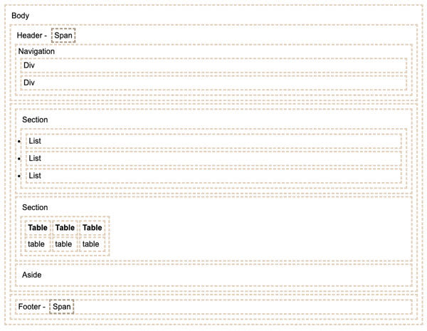

# HTML
## Big things to remember (the other things you can look up)
HTML is hyper text markup language. This provides the structure stuff.

By default, HTML shows the `index.html` page.

Tags are structural elements, attributes are things you can do to change the look or attrubutes of that tag.

## Tags
- `<!DOCTYPE html>` what kind of document you are using
- `<html lang = "en">    </html>`
    - `<head>` metadata, most of the time doesn't get rendered
    - `<body>` the stufff that gets rendered
    - `<title>` is the thing that shows up on the tab
    - `<header>` page header
    - `<main>` main content
    - `<footer>` footer of page
    - `<section>` section in page
    - `<div>` is just a general division, don't use it if there is a better label. It is a vertical block element
    - `span` inline span of content
    - `h<1-9>` different headings
    - `<p>` paragraph
    - `<table>` table
    - `<ol, ul>` ordered or unordered list
    - `a` anchor tag, has a link to another document
    - ``
        - `alt=` text if image can't render, or accessibility reasons
        - `src=` the url to the image
        - `width=` width in pixels
        - `height=` height in pixels
    - `head` header information
HTML Works with tags.

## Other tags
| element |	meaning |
| --- | --- |
| html |	The page container |
| head |	Header information |
| title |	Title of the page |
| meta |	Metadata for the page such as character set or viewport settings |
| script |	JavaScript reference. Either a external reference, or inline |
| include |	External content reference |
| body |	The entire content body of the page |
| header |	Header of the main content |
| footer |	Footer of the main content |
| nav |	Navigational inputs |
| main |	Main content of the page |
| section |	A section of the main content |
| aside |	Aside content from the main content |
| div |	A block division of content |
| span |	An inline span of content |
| h<1-9> |	Text heading. From h1, the highest level, down to h9, the lowest level |
| p |	A paragraph of text |
| b |	Bring attention |
| table |	Table |
| tr |	Table row |
| th |	Table header |
| td |	Table data |
| ol ,ul |	Ordered or unordered list |
| li |	List item |
| a |	Anchor the text to a hyperlink |
| img |	Graphical image reference |
| dialog |	Interactive component such as a confirmation |
| form |	A collection of user input |
| input |	User input field |
| audio |	Audio content |
| video |	Video content |
| svg |	Scalable vector graphic content |
| iframe |	Inline frame of another HTML page |

## Characters
- &: &amp;
- <: &lt;
- >: &gt;
- ": &quot
- ': &apos
- smiley: $#128512

What is the data structure that a browser uses to represent html -> trees. Top node is `html` element, `head` and `body` child. `title` has a child text noed of the text.

```
<body>
<p>     CSS </p>
</body>
````
This will have 4 nodes, `body`, `p`, `text`, `     CSS `

When you write CSS or JS, you reference these nodes. This tree structure is the Document Object Model (DOM).

To represent this, we use the `LiveServer` extension. Later, when we use react, it will do this automatically. Browser makes a request http://127.0.0.1:5500/index.html to IP 127.0.0.1 on port 5500. Live Server extension is listening on 5500. The live server then sends the data back. The live server injects some code that will automatically refresh it.

Developer tools, network -> headers, payload, preview, response. If we want to host it locally, caopy the image to your computer and put it in the directory.

src = "http://127.0.0.1:5500/image.png, where 5502 is the port. This is an absolute url

## Structure
Audio, video, canvas, svg, zoom in and out
Do the stuff and then study simon.

`git clone simon url`

`deploy files` script, (take a closer look)

hostname is the dns server or the server ip address.

service simon or srevice

Local vs one on the server

Need github link in footer.

## Overall Structure
```
<body>
  <p>Body</p>
  <header>
    <p>Header - <span>Span</span></p>
    <nav>
      Navigation
      <div>Div</div>
      <div>Div</div>
    </nav>
  </header>

  <main>
    <section>
      <p>Section</p>
      <ul>
        <li>List</li>
        <li>List</li>
        <li>List</li>
      </ul>
    </section>
    <section>
      <p>Section</p>
      <table>
        <tr>
          <th>Table</th>
          <th>Table</th>
          <th>Table</th>
        </tr>
        <tr>
          <td>table</td>
          <td>table</td>
          <td>table</td>
        </tr>
      </table>
    </section>
    <aside>
      <p>Aside</p>
    </aside>
  </main>

  <footer>
    <div>Footer - <span>Span</span></div>
  </footer>
</body>
```
Would produce


## Input
Here are the elements
| Element    | Meaning                          | Example                                        |
| ---------- | -------------------------------- | ---------------------------------------------- |
| `form`     | Input container and submission   | `<form action="form.html" method="post">`      |
| `fieldset` | Labeled input grouping           | `<fieldset> ... </fieldset>`                   |
| `input`    | Multiple types of user input     | `<input type="" />`                            |
| `select`   | Selection dropdown               | `<select><option>1</option></select>`          |
| `optgroup` | Grouped selection dropdown       | `<optgroup><option>1</option></optgroup>`      |
| `option`   | Selection option                 | `<option selected>option2</option>`            |
| `textarea` | Multiline text input             | `<textarea></textarea>`                        |
| `label`    | Individual input label           | `<label for="range">Range: </label>`           |
| `output`   | Output of input                  | `<output for="range">0</output>`               |
| `meter`    | Display value with a known range | `<meter min="0" max="100" value="50"></meter>` |

A `form` element will submit the values of the input you giv eit.

The input element `type` attribute
| Type           | Meaning                           |
| -------------- | --------------------------------- |
| text           | Single line textual value         |
| password       | Obscured password                 |
| email          | Email address                     |
| tel            | Telephone number                  |
| url            | URL address                       |
| number         | Numerical value                   |
| checkbox       | Inclusive selection               |
| radio          | Exclusive selection               |
| range          | Range limited number              |
| date           | Year, month, day                  |
| datetime-local | Date and time                     |
| month          | Year, month                       |
| week           | Week of year                      |
| color          | Color                             |
| file           | Local file                        |
| submit         | button to trigger form submission |


Common attributes for input elements
| Attribute | Meaning                                                                             |
| --------- | ----------------------------------------------------------------------------------- |
| name      | The name of the input. This is submitted as the name of the input if used in a form |
| disabled  | Disables the ability for the user to interact with the input                        |
| value     | The initial value of the input                                                      |
| required  | Signifies that a value is required in order to be valid                             |

> `pattern` attribute exists on `text`, `search`, `url`, `tel`, `email`, and `password` inputs. It uses regular expressions

When doing input, it seems common to do each input as list item `li`.

I don't quite understand the `form` tag.

## Media
`img`, `audio`, `video` are references to an external file, while `svg`, and `canvas` conatin code to render and animate

> make references as relative as possible

`img`
- `alt`
- `src`

### SVG
a whole thing in itself, look it up

### Canvas
You can set it up in just HTML, but you need javascript to run it