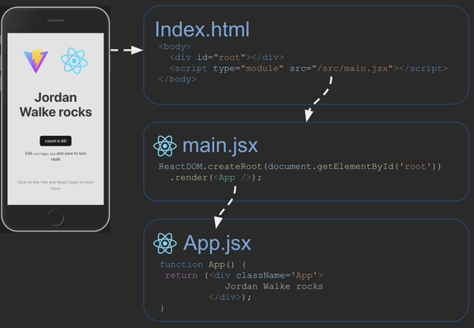

# Framework
Remember react is just javascript that is commonly used combined with HTML. Other options are `Angular`, `Svelte`, `Vue.js` and others.
- simplify common patterns
- provide common components
- improve performance
- increase device converage

Jordan Walke made React.

JSX is where Javascript and HTML are paired together. It then uses `Babel` or `Vite` (which runs `Babel`) to separate them. It can take something like:
```
const i = 3;
const list = (
  <ol class="big">
    <li>Item {i}</li>
    <li>Item {3 + i}</li>
  </ol>
);
```
Which will convert to:
```
const i = 3;
const list = React.createElement('ol', { class: 'big' }, React.createElement('li', null, 'Item ', i), React.createElement('li', null, 'Item ', 3 + i));
```
This is obviously more complicated looking, but the comptuer understand it super well.


- `const jsx = <p>Hello World</p>;` this will not work in the browser
- `const jsx = React.createElement("p", null, "Hello World");` will transpile it with `Babel`
    - `null` represents no elements
    - `Babel` basically does all the work.
- `<p>Hello World</p>` will render in the browser in the DOM

Transpiling happens on the server, execution happens on the browser. We can do this in CodePen.

# Setup
```
mkdir reactDemo && cd reactDemo
npm init -y
npm install vite@latest -D
npm install react react-dom
```
This will initalize a new `npm` directory with `vite` and `react` installed.

In our HTML file, we need to include a `<script>` tag to pull our React code in. We also include where we want the root of our code to be.
```
<body>
  <div id="root"></div>
  <script type="module" src="/index.jsx"></script>
</body>
```

Then in our `index.jsx` file, we:
1) Import `React`
2) Import `ReactDOM`
3) Define a function that will return our `App`
4) Render the app by finding the `root` and calling our `App` function.
```
import React from 'react';
import ReactDOM from 'react-dom/client';

function App() {
  return <div>Hello React</div>;
}

const root = ReactDOM.createRoot(document.getElementById('root'));
root.render(<App />);
```

Now we can compile the jsx using vite and host it. We do this with `npx vite`. This will run the node package without referencing the `package.json` file. We normally do this for js code that runs as a command line program.

Once we do this, we can click on the `localhost` link that it gives us.

## Hello World
We inject the code at `'#root'`. The `{}` allow us to escape the html to put in javascript.

This will inject the phrases.
```
const Hello = ({ phrase }) => {
    return {
        <div>Hello {phrase}</div>;
    }
};

const root = ReactDOM.createRoot(document.querySelector('#root'));
root.render(<div><Hello phrase="Friends"/><Hello phrase="enemies" /></div>);
```

In javascript, it passes in a single parameter into functions (`props` is what it is normally called), but if we use brackets (`{name}`) we can pull out an individual element of those properties.

> Note that React functions need to be capitalized or they wont work.


# Components (Functions)
This allows you to separate your code.

JSX file
```
<div>
  Component: <Demo />
</div>
```
`Demo` is a react component. The JSX file grabs it from react. `Demo` is not actually valid in HTML, but it is replaced with HTML.
> Note that these functions need to be capitalized.

React
```function Demo() {
  const who = 'world';
  return <b>Hello {who}</b>;
}
```

So we end up with this `<div>Component: <b>Hello world</b></div>`

Note that you don't need a function, you can just use variables:
```
const hello = <div>Hello</div>;
const root = ReactDOM.createRoot(document.getElementById('root'));
root.render(hello);
```
Gets
`<div>Hello</div>`

> Each component can return components inside of it. (Functions calling functions)

# CSS
Works basically the same, but use `className` on an element (in HTML) and not `class` because class is a JS keyword.

In react, we just `import ./index.css`

# Properties
You can pass information to a component like: `<div>Component: <Demo who="Walke" /><div>`. This will pass into `props` the key-value pair `who="Walke"`. We access it like
```function Demo(props) {
    return <b>Hello {props.who}</b>;
}
```

# State
```
function App() {
  const [clicked, updateClicked] = React.useState(false);

  function onClicked() {
    updateClicked(!clicked);
  }

  return <p onClick={onClicked}>clicked: {`${clicked}`}</p>;
}

const root = ReactDOM.createRoot(document.getElementById('root'));
root.render(<App />);
```

The `useState` function returns a state and also a function to update the state (`updateClicked`). So in the html `<p>`, `onClick` will call `onClicked` and update the `clicked` state. That is then what we return in the html.

> ` \` ${} \` ` is basically an f-string (with backticks around it)

Here is an example of using states
```
function App() {
  return (
    <div>
      Function Style Component: <Demo who='function' initialColor='yellow' />
    </div>
  );
}

function Demo(props) {
  const [color, setColor] = React.useState(props.initialColor);
  const [outlook, setOutlook] = React.useState('beautiful');

  function changeOutlook() {
    setOutlook(outlook === 'exciting' ? 'beautiful' : 'exciting');
  }

  function changeColor() {
    let randomColor = Math.floor(Math.random() * 16777215).toString(16);
    setColor('#' + randomColor);
  }

  return (
    <div className='component' onMouseOver={changeColor} style={{ background: color }}>
      <p>
        Hello {outlook} {props.who}
      </p>
      <button onClick={changeOutlook}>change</button>
    </div>
  );
}

const root = ReactDOM.createRoot(document.getElementById('root'));
root.render(<App />);
```
Notes:
- We set the inital color.
- get the `color` and the `colorFunc`
- write our own function to change the color
- Set the style to that color and have it call a function `onMouseOver`.

# Why it is called React
A components properties/state will react to actions and update them by calling the `render` function.

# Router
A router makes is so that we only need one HTML page. When we click a button that would normally sqitch a page, it will instead just replace the content. There are a lot of routing packages. We are using `react-router-dom` which inherits a lot from `react-router`.

The basic way to do this is a `BrowserRouter` component that covers the whole app. It has a `Link` or `NavLink` component that captures events. It then modifies what is rendered using `Routes` component with the `to` and `path` attributes.

This is what it looks like:
```
function Page({ color }) {
  return (
    <div className="page" style={{ backgroundColor: color }}>
      <h1>{color}</h1>
    </div>
  );
}

function App() {
  return (
    <BrowserRouter>
      <div className="app">
        <nav>
          <NavLink to="/">Red</NavLink>
          <NavLink to="/green">Green</NavLink>
          <NavLink to="/blue">Blue</NavLink>
        </nav>

        <main>
          <Routes>
            <Route path="/" element={<Page color="red" />} exact />
            <Route path="/green" element={<Page color="green" />} />
            <Route path="/blue" element={<Page color="blue" />} />
          </Routes>
        </main>
      </div>
    </BrowserRouter>
  );
}

const root = ReactDOM.createRoot(document.getElementById('root'));
root.render(<App />);
```

The `BrowserRouter` covers the whole component return. The `NavLinks` handle the navigation.

We can install `npm install react-router-dom` to get it.

# Toolchains
With lots of code running around, we use different tools to streamline our process.
From Github

> - Code repository - Stores code in a shared, versioned location.
> - Linter - Removes, or warns of, non-idiomatic code usage.
> - Prettier - Formats code according to a shared standard.
> - Transpiler - Compiles code into a different format. For example, from JSX to JavaScript, TypeScript to JavaScript, or SCSS to CSS.
> - Polyfill - Generates backward compatible code for supporting old browser versions that do not support the latest standards.
> - Bundler - Packages code into bundles for delivery to the browser. This enables compatibility (for example with ES6 module support), or performance (with lazy loading).
> - Minifier - Removes whitespace and renames variables in order to make code smaller and more efficient to deploy.
> - Testing - Automated tests at multiple levels to ensure correctness.
> - Deployment - Automated packaging and delivery of code from the development environment to the production environment.
> The toolchain that we use for our React project consists of GitHub as the code repository, Vite for JSX, TS, development and debugging support, ESBuild for converting to ES6 modules and transpiling (with Babel underneath), Rollup for bundling and tree shaking, PostCSS for CSS transpiling, and finally a simple bash script (deployReact.sh) for deployment.

# Vite
This code runs a vite demo
```
npm create vite@latest demoVite -- --template react
cd demoVite
npm install
npm run dev
```
Packages created:
- `index.html` where all the `main.jsx` components are loaded in
- `package.json` package and script commands 
- `package-lock.json` versions for packages
- `vite.config.js` sets up react for development
- `vite.svg` the vite logo
- `main.jsx` the code entry point
- `index.css` css file
- `App.jsx` a component loaded into `main.jsx`
- `App.css` the css for `App`
- `react.svg` the react logo



Vite uses `.jsx` files.

Commands: 
- `npm run dev` puts a temporary interactive version out there
- `npm run build` calls `vite build` and does a bunch of toolchain stuff (transpiles, minifies, injects JS) and outputs everything to a newly created sub-directory called `dist`. In there is some really gross looking `js`, `svg`, and `css` that you deploy. Note that this is what is sent to the browser adnd so the file structure is going to be pretty different.

# How to move over React from a MPA (multi page application) to a SPA
Major parts:
1) Convert HTLM and CSS to use Vite and React
2) Use JS to make it interactive and complete

**Porting** Convert from one way of doing things to another

1) Install and configure Vite
2) Reorganize the code
3) Convert to React Bootstrap
4) Enable React
5) Create app component
6) Create view components
7) Create the router
8) Convert HTML to React components
9) Replace deployment script

## Install and configure Vite
Initalize a npm package, install vite in the root directory
```
npm init -y
npm install vite@latest -D
```

Add some development scripts in `package.json`
```
"scripts": {
  "dev": "vite",
  "build": "vite build",
  "preview": "vite preview"
}
```
- `dev` is for general debugging, the auto reloading HTTP server
- `build` builds the production version (the simplified one with the crazy files)
- `preview` basically build and then dev. It bundles everything together and then does the hot reloading server

Update `.gitignore` so it doesn't include `node_modules`

## Reorganize the Code
We take the flat file system we had and we reorganize it to look something like:
```
├─ public                      # Static assets used in the app
│   ├─ favicon.ico
│   └─ placeholder.jpg
└─ src                         # Frontend React code
    ├─ app.css                 # Top level styles
    ├─ about                   # About component
    ├─ login                   # Login component
    ├─ play                    # Game play component
    └─ scores                  # Scores component
```
File Organization
- `public` holds images and sounds
- `src` holds all the react code (we split this up into the different pages)

## Convert to React Bootstrap
React Bootstrap allows you to treat Bootstrap widgets as react components.

Install it: `npm install bootstrap react-bootstrap`

Put this at the top of your file: `import 'bootstrap/dist/css/bootstrap.min.css';`

To use a specific component:
```
import Button from 'react-bootstrap/Button';

export function NavButton({ text, url }) {
  const navigate = useNavigate();
  return (
    <Button variant="primary" onClick={() => navigate({ url })}>
      {text}
    </Button>
  );
}
```

## Enable React
Install react tools with: `npm install react react-dom react-router-dom`

We create a new `index.html` that will be the new entry point for react. The other `index.html` we rename to `login.html`. It should look like this:
```
<!DOCTYPE html>
<html lang="en">
  <head>
    <meta charset="utf-8" />
    <link rel="icon" href="/favicon.ico" />
    <meta name="viewport" content="width=device-width, initial-scale=1" />
    <meta name="theme-color" content="#000000" />

    <title>Simon React</title>
  </head>
  <body>
    <noscript>You need to enable JavaScript to run this app.</noscript>
    <div id="root"></div>
    <script type="module" src="/index.jsx"></script>
  </body>
</html>
```
Notice the `root` id.


We then create an `index.jsx` file that will inject all the other code we need.
```
import React from 'react';
import ReactDOM from 'react-dom/client';
import App from './src/app';

const root = ReactDOM.createRoot(document.getElementById('root'));
root.render(<App />);
```

## Create App component
Now we want an `App` we can inject. So under `src` we create an `app.jsx` file with the following temporary contents:
```
import React from 'react';
import 'bootstrap/dist/css/bootstrap.min.css';
import './app.css';

export default function App() {
  return <div className="body bg-dark text-light">App will display here</div>;
}
```
Note that this doesn't have a `body` element. So we edit the `app.css` to select the class `body` and not the element `body`.

Then we edit `app.jsx` so it contains the header and footer (this will be consistent across pages). Then we rename `class` to `className` to not confuse js.

## Create View components
Now we make files like `login.jsx`, `play.jsx`, `scores.jsx`, and `about.jsx`. These are the basic representations for applications views. We will eventually populate these, but not right now.

Login would look like:
```
import React from 'react';

export function Login() {
  return (
    <main className="container-fluid bg-secondary text-center">
      <div>login displayed here</div>
    </main>
  );
}
```

At this point, our file structure look like this:
```
└─ src
    ├─ app.css                 # Top level styles
    ├─ about                   # About component
    │   └─ about.jsx
    ├─ login                   # Login component
    │   └─ login.jsx
    ├─ play                    # Game play component
    │   └─ play.jsx
    └─ scores                  # Scores component
        └─ scores.jsx
```

## Create the router
The router will display each component as the navigation requests. The router basically decides waht to display.

Import this into `app.jsx`.
```
import { BrowserRouter, NavLink, Route, Routes } from 'react-router-dom';
import { Login } from './login/login';
import { Play } from './play/play';
import { Scores } from './scores/scores';
import { About } from './about/about';
```

Then we wrap all of the `App` component elements in `BrowserRouter` so it has control.
```
export default function App() {
  return (
    <BrowserRouter>
      <!-- The previous component elements go here -->
    </BrowserRouter>
  );
}
```

## Navigating routes
Now we update the `<a>` tags to be React friendly: `<a className="nav-link" href="play.html">Play</a>` will become `<NavLink className='nav-link' to='play'>Play</NavLink>`

## Injecting the routed component
The router changes the rendered component and it appears in place of the Routes element. This element replaces the `main` element in component HTML.
```
 <main>App components go here</main>

 // to

<Routes>
  <Route path='/' element={<Login />} exact />
  <Route path='/play' element={<Play />} />
  <Route path='/scores' element={<Scores />} />
  <Route path='/about' element={<About />} />
  <Route path='*' element={<NotFound />} />
</Routes>
```
Note the `*` unknown path specifier. There is this neat function we can use to display an unknown url.
```
function NotFound() {
  return <main className="container-fluid bg-secondary text-center">404: Return to sender. Address unknown.</main>;
}
```

## Converting to React components
Steps for each page:
1) copy the `main` element to the `jsx` file and put it as the return value. We don't need to copy the header and footer cause they are already in the app component.
2) Rename `class` to `className`
3) Move the css over to the component using an `import` statement like `import './scores.css';`.

## Deployment
Here is our new react deployment script:
```
while getopts k:h:s: flag
do
    case "${flag}" in
        k) key=${OPTARG};;
        h) hostname=${OPTARG};;
        s) service=${OPTARG};;
    esac
done

if [[ -z "$key" || -z "$hostname" || -z "$service" ]]; then
    printf "\nMissing required parameter.\n"
    printf "  syntax: deployReact.sh -k <pem key file> -h <hostname> -s <service>\n\n"
    exit 1
fi

printf "\n----> Deploying React bundle $service to $hostname with $key\n"

# Step 1
printf "\n----> Build the distribution package\n"
rm -rf build
mkdir build
npm install # make sure vite is installed so that we can bundle
npm run build # build the React front end
cp -rf dist/* build # move the React front end to the target distribution

# Step 2
printf "\n----> Clearing out previous distribution on the target\n"
ssh -i "$key" ubuntu@$hostname << ENDSSH
rm -rf services/${service}/public
mkdir -p services/${service}/public
ENDSSH

# Step 3
printf "\n----> Copy the distribution package to the target\n"
scp -r -i "$key" build/* ubuntu@$hostname:services/$service/public

# Step 5
printf "\n----> Removing local copy of the distribution package\n"
rm -rf build
rm -rf dist
```

## Final Result
```
├─ LICENSE
├─ README.md
├─ deployReact.sh              # React specific deployment
├─ index.html                  # Single HTML file for the App
├─ index.jsx                   # Loads the top level component
├─ package.json                # Defines dependent modules
├─ public                      # Static assets used in the app
│   ├─ favicon.ico
│   └─ placeholder.jpg
└─ src                         # Frontend React code
    ├─ app.jsx                 # Top level component
    ├─ app.css
    ├─ about                   # About component
    │   ├─ about.css
    │   └─ about.jsx
    ├─ login                   # Login component
    │   └─ login.jsx
    ├─ play                    # Game play component
    │   ├─ play.jsx
    │   └─ play.css
    └─ scores                  # Scores component
        ├─ scores.css
        └─ scores.jsx
```

# React
How react tells you it needs to re render
Properties to components (parameters passed into components)
State on components (the component declares state, if that ever changes, it will re render)

The color changes, react updates, then the child component that says the color will change

React basically has a table that contains all the states. When they change, it will re render all the components.

In the React thing, we have the `render` thing. There is no html called `ColorPicker`, so it knows it is react. `Result`
`onChange` it will call a function. 

If we take out the `useState`, and change the change function to not call the react `updateColor`, we will do it ourselves.

`e` is an event that happens.

Nothing happens, it got called the first time. We first loaded it up and it got called. ColorPicker is not being called super often. The external table is our global variable. Then our timer is basically the update step of react.

Try to add a border. JSX is not html. JSX does not do styles. You need to give it an object. So we use `{}` to escape out of JSX, and `{}` to create an object.
So it looks like this `<div style={{border: "1px solid black" }}>`

The assignment is to use a textbox instead rather than a colorpicker. It needs to be a textbox. Change input `<input type="Text" onChange=<onChange>`. You can type any valid css color into it now and it will work out.


For phase 2, there is a simon react repository, there is a fully functional React thing

He took the CSS with pt 1 react version to demonstrate how to get to the next part.

What needs to be reactive in the about page? What needs to change? The picture and the quote will change

In the source code everything is hard coded. Remember react with paramaeters or state. State variable in this case. So we add `const [quote, setQuote] = React.useState('...loading')` and then in the actual quote spot, we put `{quote}`.

Change the useState to be an object `const [quote, setQuote] = React.useState({text:'...loading',author:'Lee Jensen'});` Then we just do `{quote.text}` and `{quote.author}` in the respective spots.

Then we need a function
```
function fetchQuote() {
  setQuote({text: 'Words are cheap. Showe me the code.', author: 'Linus Torvalds" });
}
```

Whenever our main `About` funciton is being calle,d that means things are getting rendered. so we just want to call `fetchQuote();` somewhere in our `About` function.

This will actually cause problems. It will re-render too much. `useEffect` will hook into the life cycle of react. That is how we respond to the lifecycle of the component.
```
React.useEffect(() => {
  setQuote({text: 'Words are cheap. Showe me the code.', author: 'Linus Torvalds" });
}, []);
```
Remembner the empty array will make it only render the first time.

Remember to fix all the `class` to `className`

If you want to add an `onClick` or something like that, we can put it in the array.


For the image
`const [image, setImage] = React.useState('placeholder.jpg');`

Then in the image representation, we do `{image}`

we can set the image in React.useState to null and that will make it not render.

Then in the event thing, we set the image to the actual image.

```
let imgHTML = <div>...loading</div>;
if (image) {
  let imgHTML = (
    <div id="picture" className="picture-box">
      
    </div>
  )
}
```

Or we can write javascript straight in jsx
```
{image && (/*the whole image thing*/)}, if the image is not there, it will 
```

Remember vite will combine all the thigns into one (you can see this with npm ... dist), so the file paths will change because of vite.

# Compiling JSX
`vite`
`npm run dev`

Type o and hit enter.

Adding routing

# React Methods
`React.`
- `createElement` will generate HMTL and when the user interacts with those, React will react.

## State and Effect

# React Hooks
- `useState` is a hook. It gives you the variablea and then update function. Whenever you call the update function, it knows it needs to react and go in and updat things.
- `useEffect` will update lifecuycle events (like rendering)
  - nothing as the second parameterwill render every time
  - `[]` will only do the first time
  - `[count1]` will render every thime `count1` changes.

```
function UseEffectHookDemo() {
  React.useEffect(() => {
    console.log('rendered');
  });

  return <div>useEffectExample</div>;
}

const root = ReactDOM.createRoot(document.getElementById('root'));
root.render(<UseEffectHookDemo />);
```

```
function Clicker() {
  const [count, update] = React.useState(5);

  return (
    <div onClick={() => update(count - 1)}>
      Click count: {count}
      {count > 0 ? <Db /> : <div>DB Connection Closed</div>}
    </div>
  );
}

function Db() {
  React.useEffect(() => {
    console.log('connected');

    return function cleanup() {
      console.log('disconnected');
    };
  }, []);

  return <div>DB Connection</div>;
}

const root = ReactDOM.createRoot(document.getElementById('root'));
root.render(<Clicker />);
```
This example will render on the first time because of the `[]` and it will keep the database open until it is clicked 5 times or so. `cleanup` is triggered after these 5 clicks.

# Reactivity
React keeps a table of `state` values. Whenever we `updateState` (returned from `React.useState()`), it will update. These updates are asyncronous so don't depend on them in the next line of code.

```
function ColorPicker() {
  const [color, updateColor] = React.useState('#737AB0');

  function onChange(e) {
    updateColor(e.target.value);
  }

  return (
    <div>
      <h1>Pick a color</h1>
      <Result selectedColor={color} />

      <p>
        <span>Pick a color: </span>
        <input type="color" onChange={onChange} value={color} />
      </p>
    </div>
  );
}

function Result({ selectedColor }) {
  return (
    <div>
      <p>
        Your color: <span style={{ color: selectedColor }}>{selectedColor}</span>
      </p>
    </div>
  );
}
```
The parent is `ColorPicker()` with a `Result()` child. The `CP` passes `color` to result as `selectedColor`. So whenever we change our color, it is passed into `Result` which will change in its end.

Basically , React does this but a lot better than we can:
```
let color;
let colorNext;

React.useState = (defaultValue) => {
  color = color || defaultValue;
  const update = (newColor) => (colorNext = newColor);
  return [color, update];
};

setInterval(() => {
  if (colorNext && color !== colorNext) {
    color = colorNext;
    root.render(ColorPicker());
  }
}, 50);

const root = ReactDOM.createRoot(document.getElementById('root'));
root.render(ColorPicker());
```