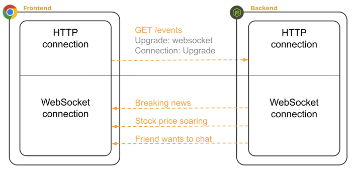

# Introduction
Step back to HTTP.

HTTP is good for client initiated request. It doesn't allow bidirectional messages.

**Polling**: They used to just ask the server consistently if there was anything to get (super inefficient)

**Long Polling**: client asks, the server gives the silent treatement until it wants to say something. The request remains open until the reply. It was using TCP in a way that TCP wasn't made for

WebSocket protocol is an upgrade of http. Either side can send data at any time. It has efficient and widespread support. It piggybacks off of HTTP. Probably won't reinvent the world, but take an existing tech and extend it in a unique way.



With Websocket, in our header we include `upgrade: websocket` and it becomes a back and forth connection. The server can act as a proxy so two users can talk with one another.
- Web RTC is direct peer communication which cuts out the backend.

> Note that two clients can't talk directly to eachother they need to use the server as an intermediary

When we use liveserver, it creates a connection between the http server it created and the connection. Whenever the server changed its code, it would go update the connection. The code they inject in is a websocket. It looks for messages coming from the server. In Network on chrome, there is a `http` protocol, and also a `ws` protocol. When we start up our code, it has a `connected` message and a `updated` message. `Vite` does this as well.

## Websocket Server
Install `nmp install ws` 

```
const { WebSocketServer } = require('ws');  // implementation of someone's server

// creates its own http server and upgrades to WebSocket
// in our code, we will actually pass an express server in

// what port we are using
const wss = new WebSocketserver({ port: 3000 });

wss.on('connection', (ws) => {  // note the wss
    ws.on('message', (data) => {    // note the ws
        const msg = String.fromCharCode(...data);
        console.log('received: %s', msg);

        ws.send(`I heard you say "${msg}"`);
    });
    ws.send('Hello webSocket');
});
```
> note that `connection` and `message` are magic strings.
So whenever we are connected, and whenever we receive a message we do one thing, if we are not connected, we just send back Hello webSocket.

Note that the first time `ws.on` is called, it just registers handler functions

## WebSocket Client
```
// are we using websocketsecure or just websocket (based off of http)
const protocol = window.location.protocol === 'http:' ? 'ws' : 'wss';

// create a new protocol
const socket = new WebSocket(`${protocol}://${window.location.host}`);
```

We register a callback `onmessage` which is super similar to an event listener that will handle incoming `messages`
```
socket.onmessage = (event) => {
  console.log('received: ', event.data);
};
```

`socket.send("listening")` will send something across

We can make a setInterval that will send more messages.

## Debugging Websocket
### Create a project 
#### Backend
1) create a directory
2) `npm init -y`
3) `npm install ws`
4) create backend `main.js` with this:
```
const { WebSocketServer } = require('ws');

const wss = new WebSocketServer({ port: 3000 });

wss.on('connection', (ws) => {
  ws.on('message', (data) => {
    const msg = String.fromCharCode(...data);
    console.log('received: %s', msg);

    ws.send(`I heard you say "${msg}"`);
  });

  ws.send('Hello webSocket');
});
```
5) Add some breakpoints
6) run using node.js
#### Frontend
We can kind of fake this one and use the chrome debugger console as if it is our js.
1) connect to `localhost:3000`
2) Paste this code
```
const protocol = window.location.protocol === 'http:' ? 'ws' : 'wss';
const socket = new WebSocket(`${protocol}://${window.location.host}`);

socket.onmessage = (event) => {
  console.log('received: ', event.data);
};
```
3) Go to `Network` and look at the http requests
4) Go to `Messages` to look at the websocket requests
5) we can use `socket.send("message")` to simulate communication

# Chat Program
See the code injection thing he did. You need to be careful with what you do to make sure no one is controlling what you do.

Pull the soruce code from the instructions in chat.

1) Make a directory
2) npm init
3) install vite and react, react dom

Add a dev vite script in the packgage
That was all the forntend

Now we create a server
new directory
npm install express and ws
That was all the backend.

index.html: root and also code injection
basic css
indeex.jsx
    React and ReactDOM

Three components: name, comment, and conversation


Chat Client (index.jsx)
js class that initalizes the websocket.
Register some handlers

Main component:
Name
Message
COnversation


Conversation
Every time the webSocket changes, it updates the chat messages

Load it all in with root and ReactDOM


Backend
Express app witi static loader, then create a websocket server. Instead of passing in the port, we pass in the server that we are using for our application.

We need to tell vite to forward the message. So we edit the vite.config.js. Edit the proxy option.

The browser tried to make the connection, it went to vite and then vite forwarded the request to the right port.

# How Simon implements websocket
clone the directory
install things (frontend in root and backend in service)
add the dbconfig

## Backend
Vite makes it from jsx to js... It transpiles the code. You can also do hot reloading with vite

`new WebSocketServer` will upgrade it

`socket.on` are the endpoints basically
`connection`, `message`, `pong` are the magic things

in service, `index.js` is the same, but when we listen on the httpServer, we call into the perrProxy code

The one connection will be upgraded to websocket

- Is all the communication over websocket or over http?
- 

## Frontend
gameNotifier
whenever the state changes, we re render the websocket information

on message: when receive notification

on open: when the websocket opens

on close: when the websocket closes

## Random
When you get an http request, express talks to it first

Express, react, node.js, vite

Express handles the stuff and debuggin on teh backend while vite handles that on the frontend

vite is a development code. It ranspiles from jsx into js and html. You load that up with express or with live reloading with vite.

One http server hosts bakcend server, another for vite hot reloading

