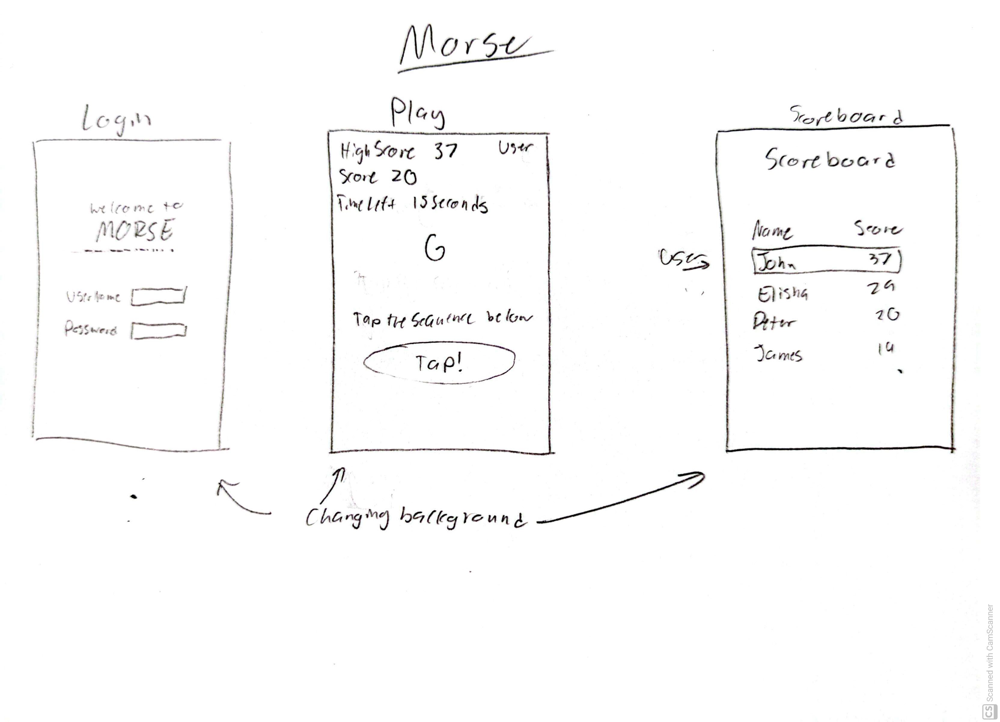

# MORS.

[notes](notes.md)

[class notes](classNotes.md)

An app that halps you practice your morse code skills. It gives you a letter and you have to type out the correct sequence. If you don't get the right sequence, your score goes down, if you do, it goes up. You have one minute to do as many as possible.

## 🚀 Specification Deliverable

For this deliverable I did the following. I checked the box `[x]` and added a description for things I completed.

- [x] Proper use of Markdown
- [x] A concise and compelling elevator pitch
- [x] Description of key features
- [x] Description of how you will use each technology
- [x] One or more rough sketches of your application. Images must be embedded in this file using Markdown image references.

### Elevator pitch
Have you ever wanted to get really good at morse code? Have you ever wanted to be able to tap out messages without anyone knowing? This app can help you learn how to do it! It gives you one minute to tap out as many letters as you can. The more you get the more your score increases. The best part it, you can see how well your friends are doing based on their score. Then, no matter the situation, you can communicate covertly with ease!

### Design

There would be three windows, Login, Play, and Scoreboard. The background of each would change every time you started a new round or went to a diffferent window. It would pull nature photos from a public image api.

### Key features

- User login
- Practice tapping out different letters and numbers in morse code
- Get as many as you can in one minute!
- Keeps track of your score
- Shares your hightest score with your friends
- See a scoreboard with all your friends

### Technologies

I am going to use the required technologies in the following ways.

- **HTML** - Clean HTML with three pages, one for the login screen, one for the playing screen, and one for the scoreboard.
- **CSS** - Make the style work for different sized devices. Have varying colors that fit a theme. Have an animated timer.
- **React** - Keeps track of user presses, changing the current character, increasing and keeping track of score, starting a new round of the game, and page direction.
- **Service** - Has endpoints for the login and updating the background image for each round (which will use one of the many public image api's).
- **DB/Login** - Stores login information and the top scores for all users.
- **WebSocket** - Users receive updated scores from the other people logged in in that moment.

### Additional Features
These are features that would be good to add, but would not be necessary to make the program work. They would be nice to have though.
- info dot that you can tap on and it will pull up a morse code cheat sheet

## 🚀 AWS deliverable

For this deliverable I did the following. I checked the box `[x]` and added a description for things I completed.

- [x] **Server deployed and accessible with custom domain name** - [My server link](https://yourdomainnamehere.click).

## 🚀 HTML deliverable

For this deliverable I did the following. I checked the box `[x]` and added a description for things I completed.

- [x] **HTML pages** - 3 html pages. One index, one for playing, and the last a scoreboard.
- [x] **Proper HTML element usage** - Utilizes different HTML elements.
- [x] **Links** - Each page has links to the others
- [x] **Text** - Text for all elements is included.
- [x] **3rd party API placeholder** - The background image will change every time a new round is started.
- [x] **Images** - Added a favicon and background image. (With other samples in my `images` directory)
- [x] **Login placeholder** - Username and password placeholders.
- [x] **DB data placeholder** - The player scores will be pulled from the database.
- [x] **WebSocket placeholder** - The Updates section will include live scores from other players.

## 🚀 CSS deliverable

For this deliverable I did the following. I checked the box `[x]` and added a description for things I completed.

- [x] **Header, footer, and main content body** - Each page has a header, footer and main content. The headers and footers are consistent across pages.
- [x] **Navigation elements** - There is a top navigation bar.
- [x] **Responsive to window resizing** - The header and footer disappears when the window gets to small. Everything stays in a good position and does not slide around.
- [x] **Application elements** - All elements for the application are represented.
- [x] **Application text content** - The text content is all there. The header and footers have unique imported fonts.
- [x] **Application images** - The image now sizes with the application and has rounded edges. It will change with an API later.

## 🚀 React part 1: Routing deliverable

For this deliverable I did the following. I checked the box `[x]` and added a description for things I completed.

- [ ] **Bundled using Vite** - I did not complete this part of the deliverable.
- [ ] **Components** - I did not complete this part of the deliverable.
- [ ] **Router** - Routing between login and voting components.

## 🚀 React part 2: Reactivity

For this deliverable I did the following. I checked the box `[x]` and added a description for things I completed.

- [ ] **All functionality implemented or mocked out** - I did not complete this part of the deliverable.
- [ ] **Hooks** - I did not complete this part of the deliverable.

## 🚀 Service deliverable

For this deliverable I did the following. I checked the box `[x]` and added a description for things I completed.

- [ ] **Node.js/Express HTTP service** - I did not complete this part of the deliverable.
- [ ] **Static middleware for frontend** - I did not complete this part of the deliverable.
- [ ] **Calls to third party endpoints** - I did not complete this part of the deliverable.
- [ ] **Backend service endpoints** - I did not complete this part of the deliverable.
- [ ] **Frontend calls service endpoints** - I did not complete this part of the deliverable.

## 🚀 DB/Login deliverable

For this deliverable I did the following. I checked the box `[x]` and added a description for things I completed.

- [ ] **User registration** - I did not complete this part of the deliverable.
- [ ] **User login and logout** - I did not complete this part of the deliverable.
- [ ] **Stores data in MongoDB** - I did not complete this part of the deliverable.
- [ ] **Stores credentials in MongoDB** - I did not complete this part of the deliverable.
- [ ] **Restricts functionality based on authentication** - I did not complete this part of the deliverable.

## 🚀 WebSocket deliverable

For this deliverable I did the following. I checked the box `[x]` and added a description for things I completed.

- [ ] **Backend listens for WebSocket connection** - I did not complete this part of the deliverable.
- [ ] **Frontend makes WebSocket connection** - I did not complete this part of the deliverable.
- [ ] **Data sent over WebSocket connection** - I did not complete this part of the deliverable.
- [ ] **WebSocket data displayed** - I did not complete this part of the deliverable.
- [ ] **Application is fully functional** - I did not complete this part of the deliverable.
